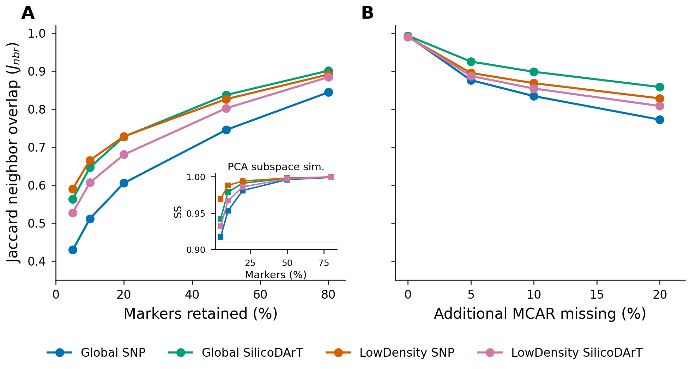

# GENO-MAP: Correspondence-Free Diagnostics for Sweet Potato Diversity Maps

<p align="center">
  
  
  
  
  
</p>

> Correspondence-free validation of disjoint DArT panels via geometry diagnostics and robustness curves; PCA is the stable analytic baseline in *n ≪ p*.

**Authors:** Rody Vilchez Marin · Christian Velasquez Borasino · Giorgio Mancusi Barreda  
**Affiliation:** Universidad Peruana de Ciencias Aplicadas (UPC), Lima, Perú

---

## 📌 Scanned the QR at the conference?

Welcome! This repository contains **all code, figures, and the reproducible pipeline** behind our poster. Here's the fast track:

| What | Where |
|------|-------|
| **View the poster (PDF)** | [`docs/poster/poster_a1.pdf`](docs/poster/poster_a1.pdf) |
| **Poster figures** | [`docs/figures/poster/`](docs/figures/poster/) |
| **Robustness experiments** | [`experiments/`](experiments/) |
| **Notebooks** | [`notebooks/`](notebooks/) |
| **Architecture decisions** | [`docs/addr/`](docs/addr/) |

---

## Overview

GENO-MAP is a lightweight, reproducible pipeline that builds 2-D embeddings and kNN graphs from DArT/DArTSeq genotyping matrices (SNP and SilicoDArT) and validates them **without requiring shared accession IDs** across panels.

The project demonstrates that PCA-30D is the operationally preferable embedding for ultra-wide genomic data (*n ≪ p*), providing deterministic geometry, high inter-seed stability (Edge-Jaccard 0.88–0.91), and smooth robustness curves — while autoencoders offer marginal trustworthiness gains at the cost of 2–5× worse topological stability.

### Key findings

| Result | Detail |
|--------|--------|
| **Subspace invariance** | PCA-30D subspace similarity SS ≥ 0.91 under 95% marker dropout |
| **Topological continuity** | kNN Jaccard degrades monotonically — no cliff effects |
| **Correspondence-free QA** | Geometry diagnostics + robustness curves work without shared IDs |
| **AE not justified** | In *n/p* < 0.3 regimes, stability dominates marginal trust gains |

## Poster

<p align="center">
  <a href="docs/poster/poster_a1.pdf">
    
  </a>
</p>

<p align="center">
  <em>Robustness under perturbation (marker subsampling & MCAR injection). Click to view the full A1 poster.</em>
</p>

## Datasets

Four disjoint DArT panels from CIP Dataverse (not version-controlled):

| Panel | *n* | *p* | *n/p* | Source |
|-------|-----|-----|-------|--------|
| Global SNP | 5 970 | 20 069 | 0.30 | [`doi:10.21223/P3/S2IMOS`](https://doi.org/10.21223/P3/S2IMOS) |
| Global SilicoDArT | 5 970 | 57 715 | 0.10 | [`doi:10.21223/P3/S2IMOS`](https://doi.org/10.21223/P3/S2IMOS) |
| LowDensity SNP | 630 | 62 732 | 0.01 | [`doi:10.21223/P3/UBDJ44`](https://doi.org/10.21223/P3/UBDJ44) |
| LowDensity SilicoDArT | 635 | 38 272 | 0.02 | [`doi:10.21223/P3/UBDJ44`](https://doi.org/10.21223/P3/UBDJ44) |

Place data under `data/` (listed in `.gitignore`). See [`data/metadata.json`](data/metadata.json) for DOIs and references.

## Setup

Requires **Python ≥ 3.10**. We use [uv](https://github.com/astral-sh/uv) for environment management.

```bash
# uv (recommended)
uv venv && source .venv/bin/activate && uv sync

# pip fallback
python -m venv .venv && source .venv/bin/activate && pip install -r requirements.txt
```

## Project structure

```
├── scripts/
│   ├── build_embeddings.py        # PCA/UMAP embedding + kNN graph builder
│   ├── generate_poster_figures.py # All poster figures (Frontiers style)
│   ├── robustness_curves.py       # Marker subsampling & MCAR injection
│   ├── panel_diagnostics.py       # Geometry QA diagnostics
│   ├── run_autoencoder.py         # AE-64D baseline comparison
│   ├── run_stability_frontier.py  # Trust/stability frontier analysis
│   ├── validate_embeddings.py     # Trustworthiness & edge-Jaccard metrics
│   └── run_*.sh                   # Dataset driver scripts
├── notebooks/
│   ├── ae_vs_baseline.ipynb       # AE vs PCA comparison
│   ├── visual_diagnostics.ipynb   # Geometry diagnostic visualisations
│   ├── data_catalog.ipynb         # Reproducible data catalog
│   ├── eda_variables.ipynb        # Variable exploration
│   └── revision_datasets.ipynb    # CSV validation
├── experiments/                   # Tracked runs (runs.jsonl) + outputs
├── docs/
│   ├── poster/                    # A1 beamerposter (LuaLaTeX)
│   ├── addr/                      # Architecture Decision Records (ADR 0001–0008)
│   ├── memoria/                   # Short paper drafts
│   └── figures/poster/            # Generated figures (PNG + PDF)
└── data/                          # Raw DArT matrices (not tracked)
```

## Usage

### Build embeddings

```bash
# Preview run (200 samples, 5000 markers)
python scripts/build_embeddings.py \
  --input data/10.21223P30BVZYY_Genetic_diversity/SNP_Genotypes.csv \
  --max-samples 200 --max-markers 5000 \
  --neighbors 15 --metric cosine \
  --out-prefix data/outputs/global_snp_preview

# Full run
python scripts/build_embeddings.py \
  --input data/10.21223P30BVZYY_Genetic_diversity/SNP_Genotypes.csv \
  --max-samples 0 --max-markers 0 --limit-rows 0 \
  --neighbors 20 --metric cosine \
  --out-prefix data/outputs/global_snp_full
```

For SilicoDArT (binary) use `--metric jaccard`.

### Driver scripts

Pre-configured scripts that log runs to `experiments/runs.jsonl`:

```bash
scripts/run_global_snp.sh
scripts/run_global_silico.sh
scripts/run_lowdensity_snp.sh
scripts/run_lowdensity_silico.sh
scripts/run_wild_snp.sh
```

Override via env: `METRIC`, `NEIGHBORS`, `MAX_SAMPLES`, `MAX_MARKERS`, `LIMIT_ROWS`, `RUN_TAG`, `SEED`, `NOTES`.

### Generate poster figures

```bash
python scripts/generate_poster_figures.py --outdir docs/figures/poster
```

### Compile poster

```bash
cd docs/poster && lualatex poster_a1.tex
```

Requires `texlive-full` (beamerposter, fontspec, tcolorbox, tikz, orcidlink).

## Outputs

| File | Description |
|------|-------------|
| `*_nodes.json` | Node list with `id`, `embedding: [x, y]`, `meta` — for 2-D scatter plots |
| `*_edges.json` | kNN edges (`source`, `target`, `distance`) — for graph layouts |
| `*_stats.json` | Summary: samples, markers, missing_rate, metric, neighbors |

## Documentation

- **ADRs** ([`docs/addr/`](docs/addr/)): architectural decisions from data download through stability frontier analysis (0001–0008)
- **Poster** ([`docs/poster/poster_a1.pdf`](docs/poster/poster_a1.pdf)): camera-ready A1 beamerposter (LuaLaTeX)
- **Figures** ([`docs/figures/poster/`](docs/figures/poster/)): all figures in Okabe-Ito palette, 300 DPI

## Citation

If you find this work useful, please cite:

```
Vilchez, R., Borasino, C., & Mancusi, G. (2026).
GENO-MAP: Correspondence-Free Diagnostics for Sweet Potato Diversity Maps.
Universidad Peruana de Ciencias Aplicadas (UPC).
```

## License

Academic project — Universidad Peruana de Ciencias Aplicadas (UPC), 2025–2026.
