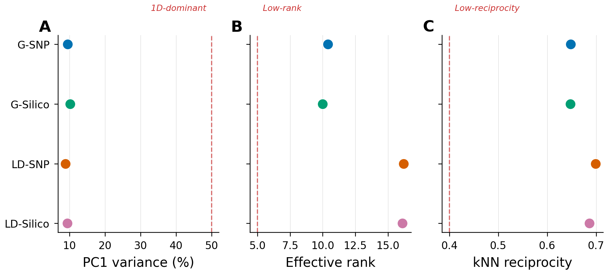
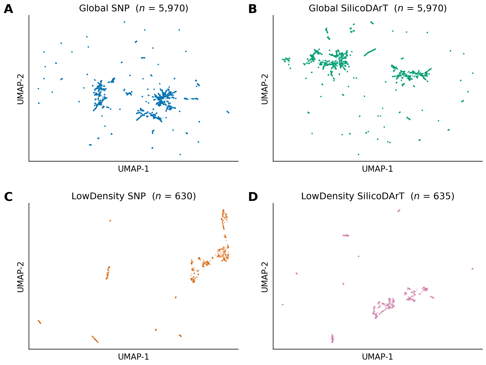
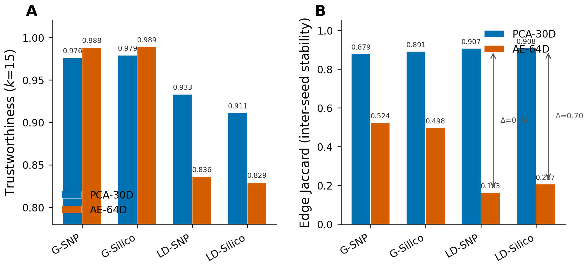
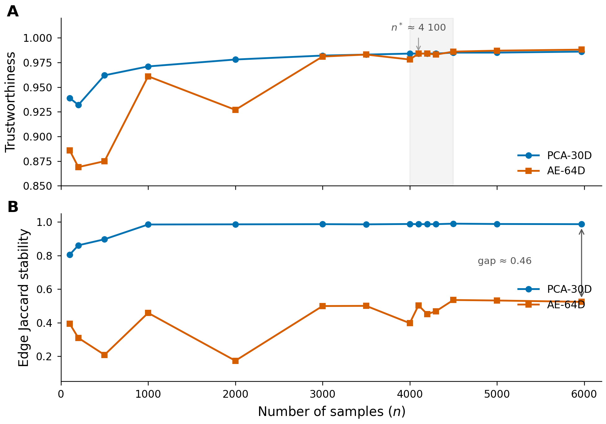

# GENO-MAP: Correspondence-Free Diagnostics and Robustness Curves for Sweet Potato Diversity Maps

**Rody Vilchez ¹** · Universidad Nacional Agraria La Molina / CIP  
*Poster — Frontiers in Plant Science (target)*

---

## Figure Inventory

| Fig | Título | Status | Asset |
|-----|--------|--------|-------|
| 1 | Disjoint IDs → correspondence-free motivation | 🟡 MOCK | *diagrama conceptual — draw.io/TikZ* |
| 2 | Pipeline flowchart | 🟡 MOCK | *diagrama conceptual — draw.io/TikZ* |
| 3 | Panel geometry diagnostics + QA flags | ✅ DONE | `docs/figures/poster/fig3_panel_geometry.png` |
| 4 | Robustness HERO (marker sub + miss inj + SS inset) | ✅ DONE | `docs/figures/poster/fig4_robustness_hero.png` |
| 5 | UMAP diversity scatter (4 panels) | ✅ DONE | `docs/figures/poster/fig5_umap_scatter.png` |
| 6 | PCA vs AE quality–stability trade-off | ✅ DONE | `docs/figures/poster/fig6_pca_vs_ae.png` |
| 10 | Stability frontier (trust crossover + gap) | ✅ DONE | `docs/figures/poster/fig10_stability_frontier.png` |

---

## Poster Layout (A0 portrait, 841 × 1189 mm)

```
┌──────────────────────────────────────────────────────────┐
│                        TÍTULO                            │
│  GENO-MAP: Correspondence-Free Diagnostics and           │
│  Robustness Curves for Sweet Potato Diversity Maps       │
│                  Rody Vilchez · UNALM / CIP              │
├────────────────────┬─────────────────────────────────────┤
│                    │                                     │
│   1. MOTIVATION    │        2. PIPELINE                  │
│                    │                                     │
│   [FIG 1: IDs      │   [FIG 2: DArT → impute →          │
│    disjuntos]      │    PCA → UMAP → kNN → JSON]        │
│                    │                                     │
├────────────────────┴─────────────────────────────────────┤
│                                                          │
│   3. PANEL GEOMETRY                    4. DATA           │
│                                                          │
│   [FIG 3: dot-plot 3 métricas ✅]      Tabla 1 (compact) │
│                                                          │
├──────────────────────────────────────────────────────────┤
│                                                          │
│   5. DIVERSITY MAPS               6. ROBUSTNESS          │
│                                                          │
│   [FIG 5: UMAP 4 paneles ✅]  [FIG 4: HERO ✅]       │
│                                                          │
├──────────────────────────────────────────────────────────┤
│                                                          │
│   7. PCA vs AUTOENCODER           8. FRONTIER            │
│                                                          │
│   [FIG 6: grouped bars ✅]        [FIG 10: crossover ✅] │
│                                                          │
├──────────────────────────────────────────────────────────┤
│                                                          │
│   9. CONCLUSIONS               10. REFERENCES            │
│   • 4 bullet points            • 5 refs                  │
│   • QR code → repo             • CIP Dataverse           │
│                                                          │
└──────────────────────────────────────────────────────────┘
```

---

## 1. Motivation

> Los bancos de germoplasma de camote almacenan miles de accesiones genotipadas en paneles independientes con **identificadores disjuntos** (accesiones CIP vs. coordenadas plate/well DArT). Sin un manifest externo, el alignment cruzado es imposible. GENO-MAP introduce validación **correspondence-free**: diagnósticos geométricos + curvas de robustez que operan intra-panel.

### 📐 Fig. 1 — Disjoint Identifiers (MOCK)

> **[PLACEHOLDER — diagrama conceptual]**
>
> Layout: dos rectángulos lado a lado representando los paneles Global y LowDensity.
>
> ```
>  ┌─────────────────┐         ┌─────────────────┐
>  │   GLOBAL PANEL  │         │ LOWDENSITY PANEL │
>  │                 │         │                  │
>  │  IDs: CIP-XXX  │   ✗✗✗   │  IDs: plate/well │
>  │  n = 5 970     │  no link │  n = 630–635     │
>  │  p = 20k–57k   │         │  p = 38k–62k     │
>  │                 │         │                  │
>  │  SNP + Silico  │         │  SNP + Silico    │
>  └─────────────────┘         └─────────────────┘
>           │                           │
>           ▼                           ▼
>  ┌──────────────────────────────────────────┐
>  │  Correspondence-Free Validation          │
>  │  • Per-panel geometry diagnostics        │
>  │  • Robustness curves (perturbations)     │
>  │  • No cross-panel alignment needed       │
>  └──────────────────────────────────────────┘
> ```
>
> **Estilo**: Colores Okabe-Ito (azul = Global, vermilion = LowDensity). Flechas rotas (✗) entre paneles. Flecha sólida hacia bloque inferior. Texto mínimo, Arial 14pt+.
>
> **Herramienta sugerida**: draw.io, Inkscape, o TikZ. Exportar SVG → PDF.

---

## 2. Pipeline

### 📐 Fig. 2 — GENO-MAP Pipeline (MOCK)

> **[PLACEHOLDER — flowchart]**
>
> Flujo horizontal de 6 bloques conectados por flechas:
>
> ```
>  ┌──────┐    ┌──────────┐    ┌───────┐    ┌──────┐    ┌──────┐    ┌──────┐
>  │ DArT │───▶│ Impute   │───▶│  PCA  │───▶│ UMAP │───▶│ kNN  │───▶│ JSON │
>  │Matrix│    │(mode/med)│    │ 30 PC │    │  2D  │    │k=15  │    │nodes │
>  │n × p │    │SimpleImp │    │determ.│    │ viz  │    │cosine│    │edges │
>  └──────┘    └──────────┘    └───┬───┘    └──────┘    └──────┘    └──────┘
>                                  │
>                                  ▼
>                          ┌──────────────┐
>                          │  Validation  │
>                          │  Framework   │
>                          │              │
>                          │ • Geometry   │
>                          │   diagnostics│
>                          │ • Robustness │
>                          │   curves     │
>                          │ • AE bench   │
>                          └──────────────┘
> ```
>
> **Notas de diseño**:
> - Bloques superiores = pipeline de producción (fondo azul claro)
> - Bloque inferior = módulos de validación (fondo gris claro)
> - Flecha desde PCA baja hacia Validation (el grafo se construye sobre PCA, no UMAP)
> - Cada bloque tiene 2–3 palabras clave y un icono minimal
> - PCA resaltado con borde más grueso (es el espacio analítico fijo)
>
> **Herramienta sugerida**: draw.io con tema flat/minimal. Exportar SVG → PDF.

---

## 3. Panel Geometry & QA

### Tabla 1 (compacta para poster)

| Panel | $n$ | $p$ | $n/p$ | PC1% | Eff.Rank | Recip. | Flags |
|-------|-----|-----|-------|------|----------|--------|-------|
| G-SNP | 5 970 | 20k | 0.297 | 9.5 | 10.4 | 0.65 | DISCONN |
| G-Silico | 5 970 | 57k | 0.103 | 10.2 | 10.0 | 0.65 | DISCONN |
| LD-SNP | 630 | 62k | 0.010 | 8.9 | 16.2 | 0.70 | EXTREME-WIDE, HIGH-MISS |
| LD-Silico | 635 | 38k | 0.017 | 9.5 | 16.1 | 0.69 | EXTREME-WIDE |

### ✅ Fig. 3 — Panel Geometry Diagnostics



*Dot-plot of three geometry metrics across four DArT panels. Dashed red lines indicate QA flag thresholds from the automated diagnostic module: PC1 > 50% (1D-dominant), effective rank < 5 (low-rank), kNN reciprocity < 0.40 (low-reciprocity). All panels fall well within healthy ranges.*

**Takeaway**: Geometría saludable en los 4 paneles. Sin colapso 1D, rango efectivo moderado (10–16), reciprocidad kNN fuerte (0.65–0.70).

---

## 4. Diversity Maps

### ✅ Fig. 5 — UMAP Diversity Scatter



*2×2 UMAP scatter plots of the four DArT panels (seed 42). (A) Global SNP ($n$ = 5,970), (B) Global SilicoDArT ($n$ = 5,970), (C) LowDensity SNP ($n$ = 630), (D) LowDensity SilicoDArT ($n$ = 635). Tick labels omitted — UMAP coordinates are not directly interpretable. Colour follows panel identity (Okabe-Ito palette).*

**Takeaway**: Los paneles Global muestran estructura continua con clusters visibles. Los paneles LowDensity tienen menor densidad muestral pero revelan agrupaciones claras.
---

## 5. Robustness

### ✅ Fig. 4 — Robustness HERO


*(A) kNN neighborhood overlap ($J_{\text{nbr}}$) under marker subsampling (5–80% retention). Inset: PCA subspace similarity remains ≥ 0.91 even at 5% markers. (B) $J_{\text{nbr}}$ under MCAR missing injection (+0–20%). Degradation is monotonic and predictable across all four panels.*

**Takeaway**: La topología del grafo degrada gradualmente bajo perturbaciones severas, pero el subespacio PCA es extremadamente robusto (SS > 0.91 al 5% de marcadores).

---

## 6. PCA vs Autoencoder

### ✅ Fig. 6 — Quality–Stability Trade-off



*(A) Trustworthiness (k=15): AE-64D gains +1 pp on Global panels but loses −8 to −10 pp on LowDensity. (B) Edge Jaccard stability: PCA maintains 0.88–0.91 across all panels; AE drops to 0.16–0.52, with LowDensity panels showing near-random graph reproducibility between seeds.*

**Takeaway**: El AE ofrece mejora marginal de trust con alto $n$, pero sacrifica estabilidad topológica en todos los casos. Para $n \ll p$, PCA es el baseline más confiable.

---

## 7. Stability Frontier

### ✅ Fig. 10 — Stability Frontier



*(A) Trustworthiness vs. sample size $n$ for Global SNP: AE crosses PCA at $n^* \approx 4\,100$ ($n/p \approx 0.20$). Grey band highlights crossover region. (B) Edge Jaccard stability: AE never converges to PCA level — gap ≈ 0.46 at maximum $n = 5\,970$.*

**Takeaway**: Incluso cuando el AE iguala la trust de PCA, la estabilidad del grafo kNN nunca converge. El crossover es real pero operacionalmente irrelevante.

---

## 8. Conclusions (poster bullets)

1. **GENO-MAP** convierte matrices DArT/DArTSeq en grafos kNN reproducibles (Jaccard ≥ 0.989 en PCA-30D) con trustworthiness > 0.92.

2. El marco **correspondence-free** valida paneles con IDs disjuntos sin alignment espurio: diagnósticos geométricos + curvas de robustez.

3. La topología del grafo es **robusta**: SS ≥ 0.91 al 5% de marcadores; insensible a imputación moda vs mediana (Jaccard > 0.91).

4. **PCA > AE** en estos regímenes: estabilidad topológica 2–5× superior, overhead computacional mínimo, representaciones deterministas.

---

## 9. References (poster — top 5)

1. Venna & Kaski (2006). Local multidimensional scaling. *Neural Networks*, 19(6–7).
2. McInnes *et al.* (2018). UMAP. *arXiv:1802.03426*.
3. Kilian *et al.* (2012). DArT on open platforms. *Methods Mol. Biol.*, 888.
4. Roy *et al.* (2005). Participation ratio. *Phys. Rev. E*, 72(2).
5. CIP Dataverse. https://data.cipotato.org/

---

## Action Items — Figuras pendientes

### Prioridad alta (necesarias para poster)

- [ ] **Fig 1 — IDs disjuntos**: Diagrama conceptual en draw.io/Inkscape. Exportar a PDF+PNG 300 DPI. ~2h trabajo manual.
- [ ] **Fig 2 — Pipeline**: Flowchart en draw.io/Inkscape. Exportar a PDF+PNG 300 DPI. ~2h trabajo manual.

### Prioridad media (mejora el poster)

- [x] **Fig 5 — UMAP scatter**: `fig5_umap_scatter()` añadido a `generate_poster_figures.py`. Carga coords desde `experiments/*/poster-v2/seed42_*_nodes.json`. ✅ Generado.

### Opcionales

- [ ] **Fig 7 — UMAP PCA vs AE side-by-side**: Reciclar `comparison/03_umap_side_by_side.png` o regenerar. Bajo valor evidencial vs espacio que consume.
- [ ] **Tabla poster**: Versión compacta de Tabla 1 con los 4 datasets, formateada para poster A0 (font ≥ 24pt).
- [ ] **QR code**: Generar QR → repositorio GitHub. Colocar en esquina inferior derecha.

---

*Compilado: marzo 2026*
*Figuras generadas: `scripts/generate_poster_figures.py`*
*Output: `docs/figures/poster/`*
